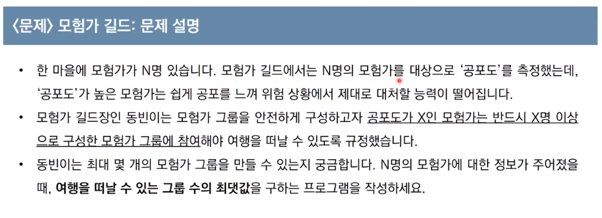

 13강 그리디 알고리즘 유형 문제 풀이 ([링크](https://youtu.be/_TG0hVYJ6D8))

---


1. N=17,K=4 (17-1=16)
2. 16/4, 4
3. 4/4, 1

---


1. 25/ 5, 5
2. 5/5, 1
3. N이 1이 될때까지 수행과정이 2단계 수행함

---


문제해결 아이디어


정당성 분석

- <u>*가능하면 최대한 많이 나누는 작업*</u>이 최적의 해를 항상 보장할 수 있는가?
- N이 아무리 큰 수여도, K로 계속 나눈다면 기하급수적으로 빠르게 줄일 수 있다.
- 다시 말해 K가 2 이상이기만 하면, K로 나누는 것이 1을 빼는 것보다 항상 빠르게 N을 줄일 수 있다.
  - 또한 N은 항상 1에 도달하게 된다 (최적의 해 성립)

---


답안 예시

```python
# N, K을 공백 기준으로 구분하여 입력 받기
n, k = map(int, input().split())

result = 0

while True:
    # N이 K로 나누어 떨어지는 수가 될 때까지 빼기
    target = (n//k)*k
    result += (n-target)
    print("n=",n," | target=",target," | 연산횟수=",result)
    n=target
    
    # N이 K보다 작을 때 (더이상 나눌 수 없을 때)
    # 반복문 탈출
    if n < k:
        break
    # k로 나누기
    result += 1
    n //= k

# 마지막으로 남은 수에 대하여 1씩 빼기
print("-- 연산횟수(result)를 -1 처리 --")
result += (n - 1)
print("연산결과=",result)

# 17 4
# n= 17  | target= 16  | 연산횟수= 1
# n= 4  | target= 4  | 연산횟수= 2
# n= 1  | target= 0  | 연산횟수= 4
# -- 연산횟수(result)를 -1 처리 --
# 
# 연산결과= 3
```

- result 변수는 연산을 수행하는 총 횟수 1를 빼는 연산(n-target)을 몇 번 수행할지 한번에 계산해서 넣어줌

---


---

문제 해결 아이디어

- 대부분의 경우 '+' 보다는 'x'가 더 값을 크게 만듭니다.
  - 예를 들어 5+6=11이고, 5*6=30
- (Tip) 다만 두 수 중에서 하나라도 '0' 혹은 '1'인 경우, 곱하기 보다는 더하기를 수행하는 것이 효율적이다.
- 따라서 <u>*두 수에 대하여 연산을 수행할 때, 두 수 중에서 하나라도 1 이하인 경우에는 더하며, 두 수가 모두 2 이상인 경우에는 곱하면 정답*</u>

```python
data = input()

# 첫 번째 문자를 숫자로 변경하여 대입
result = int(data[0])

for i in range(1, len(data)):
    # 두 수 중에서 하나라도 '0' 혹은 '1'인 경우, 곱하기보다는 더하기 수행
    num = int(data[i])
    if num <=1 or result <=1:
        result += num
        print("#[덧셈] i=",i," | num=",num," | result=",result)
    else:
        result *= num
        print("#[곱셈] i=",i," | num=",num," | result=",result)
   

print(result)

#02984
#[+] i= 1  | num= 2  | result= 2
#[*] i= 2  | num= 9  | result= 18
#[*] i= 3  | num= 8  | result= 144
#[*] i= 4  | num= 4  | result= 576
#576
```

---




---

해결아이디어


```python
n = int(input())
data = list(map(int, input().split()))
data.sort()

print("[DEBUG] data.sort()=",data)
result = 0 # 총 그룹의 수
count = 0 # 현재 그룹에 포함된 모험가의 수

for i in data: # 공포도를 낮은 것부터 하나씩 확인하며
    count += 1 # 현재 그룹에 해당 모험가를 포함
    if count >= i: #현재 그룹에 포함된 모험가의 수가 현재의 공포도 이상이라면, 그룹 결성
        print("[DEBUG] if count=",count)
        result += 1 # 총 그룹의 수 증가시키기
        count = 0 # 현재 그룹에 포함된 모험가의 수 초기화
    
print(result)


# 5
# 2 3 1 2 2
# [DEBUG] data.sort()= [1, 2, 2, 2, 3]
# [DEBUG] if count= 1
# [DEBUG] if count= 2
# 2
```

