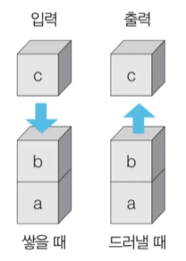
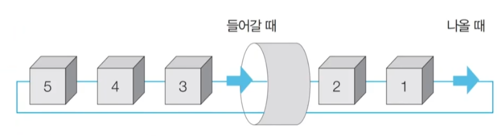

16강 스택과 큐 자료구조 ([링크](https://youtu.be/7iLoLcna7Hw))

---

그래프 탐색 알고리즘 : DFS/BFS

- 탐색(Search)이란 많은 양의 데이터 중에서 **원하는 데이터를 찾는 과정**을 말한다.
- 대표적인 그래프 탐색 알고리즘으로는 DFS 와 BFS가 있다.
- <u>DFS/BFS는 코딩 테스트에서 매우 자주 등장하는 유형</u>이므로 반드시 숙지해야 한다.


스택 자료구조



- 먼저 들어 온 데이터가 나중에 나가는 형식(선입후출)의 자료구조
- <u>입구와 출구가 동일한 형태</u>로 스택을 시각화할 수 있다.


스택 구현 예제

```python
stack = []

stack.append(5) # 삽입
stack.append(2)
stack.append(3)
stack.append(7)
stack.pop()     # 삭제
stack.append(1)
stack.append(4)
stack.pop()

print(stack[::-1]) # 최상단 원소부터 출력
print(stack) # 최하단 원소부터 출력


# [1, 3, 2, 5]
# [5, 2, 3, 1]
```


큐 자료구조

- 먼저 들어 온 데이터가 먼저 나가는 형식(선입선출)의 자료구조
- 큐는 입구와 출구가 모두 뚫려 있는 터널과 같은 형태로 시각화



큐 구현 예제

```python
from collections import deque

# 큐(Queue) 구현을 위해 deque 라이브러리 사용
queue = deque()

queue.append(5) # 삽입
queue.append(2)
queue.append(3)
queue.append(7)
queue.popleft() # 삭제
queue.append(1)
queue.append(4)
queue.popleft()

print(queue) # 먼저 들어온 순서대로 출력
queue.reverse() # 역순으로 바꾸기
print(queue) # 나중에 들어온 원소부터 출력

# deque([3, 7, 1, 4])
# deque([4, 1, 7, 3])
```

- 시간 복잡도 때문에 list를 쓰지 않는 것을 권한다.

