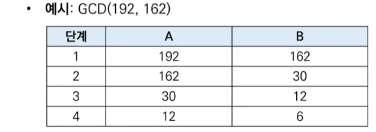

17강 재귀 함수 ([링크](https://youtu.be/gFpKGWdEE5g))

---

- 재귀함수(Recursive Function)란 자기 자신을 다시 호출하는 함수
- 단순한 형태의 재귀 함수 예제
  - '재귀 함수를 호출합니다.'라는 문자열을 무한히 출력
  - 어느 정도 출력하다가 최대 재귀 깊이 초과 메시지 출력

```python
def recursive_function():
    print('재귀 함수를 호출합니다.')
    recursive_function()
    
recursive_function()


# 재귀 함수를 호출합니다.
# Traceback (most recent call last):
#   File "main.py", line 5, in <module>
#     recursive_function()
#   File "main.py", line 3, in recursive_function
#     recursive_function()
#   File "main.py", line 3, in recursive_function
#     recursive_function()
#   File "main.py", line 3, in recursive_function
#     recursive_function()
#   [Previous line repeated 992 more times]
#   File "main.py", line 2, in recursive_function
#     print('재귀 함수를 호출합니다.')
# RecursionError: maximum recursion depth exceeded while calling a Python object
```


재귀 함수의 종료 조건

- 재귀 함수를 문제 풀이에서 사용할 때는 재귀 함수의 종료 조건을 반드시 명시
- 종료 조건을 제대로 명시하지 않으면 함수가 무한히 호출될 수 있다.
  - 종료 조건을 포함한 재귀 함수 예제

```python
def recursive_function(i):
    # 100번째 호출을 했을 때 종료되도록 명시
    if i == 100:
        return
    print(i, '번째 재귀함수에서', i+1,'번째 재귀함수를 호출')
    recursive_function(i+1)    
    print(i, '번째 재귀함수를 종료')
    
recursive_function(1)

# ...
# 98 번째 재귀함수에서 99 번째 재귀함수를 호출
# 99 번째 재귀함수에서 100 번째 재귀함수를 호출
# 99 번째 재귀함수를 종료
# 98 번째 재귀함수를 종료
# ...
```


팩토리얼 구현 예제

```python
# 반복적으로 구현한 n!
def factorial_iterative(n):
    result = 1
    # 1부터 n까지의 수를 차례대로 곱하기
    for i in range(1, n+1):
        result *= i
    return result

# 재귀적으로 구현한 n!
def factorial_recursive(n):
    if n <= 1: # n이 1 이하인 경우 1을 반환
        return 1
    # n! = n * (n - 1)!를 그대로 코드로 작성
    return n * factorial_recursive(n-1)

# 각각의 방식으로 구현한 n! 출력(n = 5)
print('반복적으로 구현:', factorial_iterative(5))
print('재귀적으로 구현:', factorial_recursive(5))

# 반복적으로 구현: 120
# 재귀적으로 구현: 120
```


최대공약수 계산 (유클리드 호제법) 예제

- 두 개의 자연수에 대한 최대공약수를 구하는 대표적인 알고리즘으로는 유클리드 호제법이 있다.
- 유클리드 호제법
  - 두 자연수 A,  B에 대하여 (A > B) A를 B로 나눈 나머지를 R이라고 한다.
  - 이때 A와 B의 최대공약수는 B와 R의 최대 공약수와 같다
- 유클리드 호제법의 아이디어를 그대로 재귀 함수로 작성할 수 있다.




예제 코드

```python
def gcd(a, b):
    if a % b == 0:
        return b
    else:
    	return gcd(b, a % b)
    
print(gcd(192, 162))

# 6
```


재귀 함수 사용의 유의 사항

- 재귀 함수를 잘 활용하면 복잡한 알고리즘을 간결하게 작성
  - 단, 오히려 다른 사람이 이해하기 어려운 형태의 코드가 될 수 있으므로 신중하게 사용
- 모든 <u>재귀 함수는 반복문을 이용하여 동일한 기능을 구현</u>할 수 있다.
- 재귀 함수가 반복문보다 유리한 경우도 있고 불리한 경우도 있다.
- 컴퓨터가 함수를 연속적으로 호출하면 컴퓨터 메모리 내부의 스택 프레임에 쌓인다.
  - 그래서 스택을 사용해야 할 때 구현상 **스택 라이브러리 대신에 재귀 함수를 이용**하는 경우가 많다.

