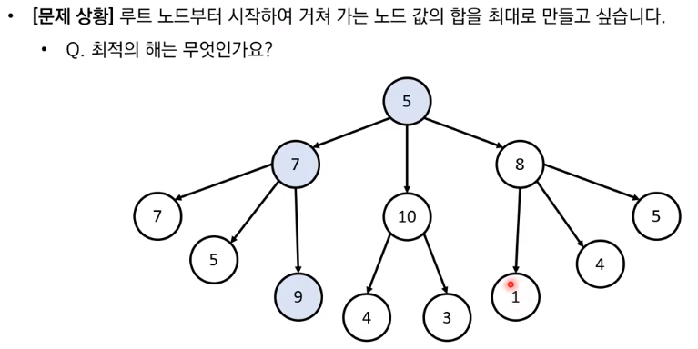
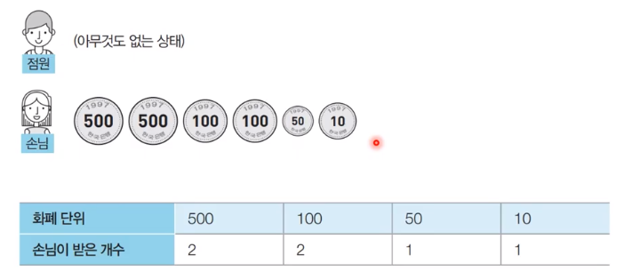

12강 그리디 알고리즘 개요 ([링크](https://youtu.be/5OYlS2QQMPA))

---

- 그리디 알고리즘(탐욕법)은 <u>*현재 상황에서 지금 당장 좋은 것만 고르는 방법*</u>을 의미
- 일반적인 그리디 알고리즘은 문제를 풀기 위한 최소한의 아이디어를 떠올릴 수 있는 능력을 요구
- 그리디 해법은 그 정당성 분석이 중요
  - 단순히 가증 좋아 보이는 것을 반복적으로 선택해도 최적의 해를 구할 수 있는 지 검토



- 5 + 7 + 9 = 21 (가장 큰 값)
- 단순히 가장 큰 값만 선택한다면?
  - 5 + 10 + 4 = 19 (최적의 해보다 낮은 값을 얻는다)

정리

- 일반적인 상황에서 그리디 알고리즘은 최적의 해를 보장 할 수 없을 때가 많다.
- 하지만 코딩 테스트에서의 대부분의 그리디 문제는 <u>*탐욕법으로 얻은 해가 최적의 해가 되는 상황에서, 이를 추론*</u>할 수 있어야 풀리도록 출제

연습문제, 거스름 돈

- 당신은 음식점의 계산을 도와주는 점원이다.
- 카운터에는 거스름돈으로 사용할 500원, 100원, 50원, 10원짜리 동전이 무한히 존재한다고 가정
- 손님에게 거슬러 주어야 할 돈이 N원일 때 거슬러 주어야 할 동전의 최소 개수를 구하시오
- 단, 거슬러 줘야 할 돈 N은 항상 10의 배수

거스름돈 문제 해결 아이디어

- 최적의 해를 빠르게 구하기 위해서는 가장 큰 화폐 단위부터 돈을 거술러 주면 된다.
- N원을 거슬러 줘야 할 때, 가장 먼저 500원으로 거슬러 줄 수 있을 만큼 거슬러 준다.
  - 이후에 100원, 50원, 10원 짜리 동전을 차례대로 거슬러 줄 수 있을 만큼 거슬러 주면 된다.
- N = 1,260일 떄의 예시를 확인



정당성 분석

- 가장 큰 화폐 단위부터 돈을 거슬러 주는 것이 최적의 해를 보장하는 이유는 뭘까?
  - 가자고 있는 동전 중에서 <u>*큰 단위가 항상 작은 단위의 배수이므로 작은 단위의 동전들을 종합해 다른 해가 나올 수 없기 때문*</u>
- 만약에 800원을 거슬러 주어야 하는데 화폐 단위가 500원, 400원, 100원 이라면 어떨까? (400원 동전 2개로 처리하는 게...)
- 그리디 알고리즘 문제에서는 이처럼 문제 풀이를 위한 최소한의 아이디어를 떠올리고 이것이 정당한지 검토할 수 있어야 한다.

거스름 돈: 답안 예시

```python
n = 1260
count = 0

# 큰 단위의 화폐부터 차례대로 확인
array = [500, 100, 50, 10]

for coin in array:
    # 해당 화폐로 거슬러 줄 수 있는 동전의 개수 세기
    count += n // coin
    # n은 coin으로 나눈 나머지 값 저장
    n %= coin
    print("# 동전단위=",coin," / 동전갯수(누적)=",count," / 나머지=",n)
    
print("# 결과=",count)


# 동전단위= 500  / 동전갯수(누적)= 2  / 나머지= 260
# 동전단위= 100  / 동전갯수(누적)= 4  / 나머지= 60
# 동전단위= 50  / 동전갯수(누적)= 5  / 나머지= 10
# 동전단위= 10  / 동전갯수(누적)= 6  / 나머지= 0
# 결과= 6
```

- 화폐의 종류가 K라고 할 떄, 소스코드의 시간 복잡도는 O(K)이다.
- 이 알고리즘의 시간 복잡도는 거슬러줘야 하는 금액과 무관 하며, 동전의 총 종류에만 영향을 받는다.
