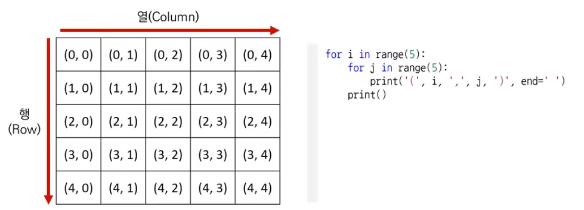
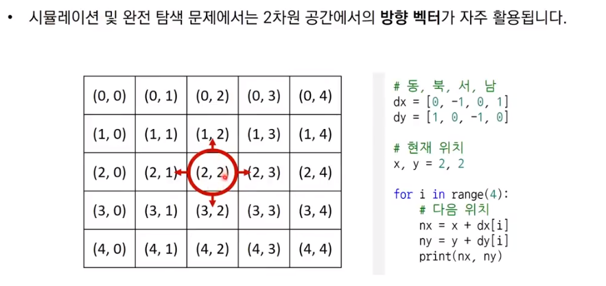
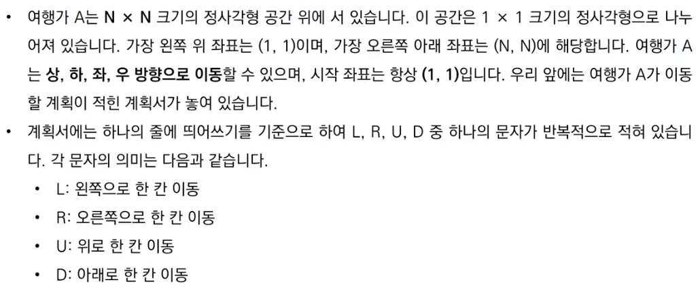
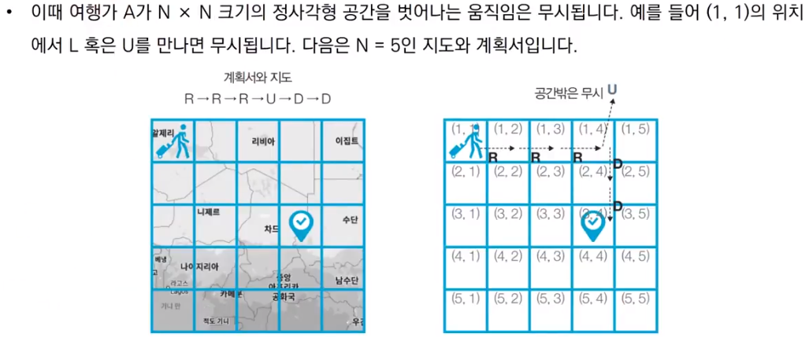
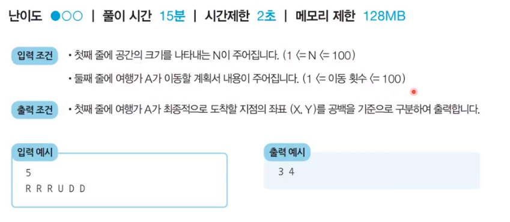

 14강 구현 유형 개요 ([링크](https://youtu.be/puH2p1CQEg4))

---

구현(Implementation)

- 구현이란, <u>*머릿속에 있는 알고리즘을 소스코드로 바꾸는 과정*</u>

> problem → thinking → solution

- 흔히 알고리즘 대회에서 구현 유형의 문제란 무엇을 의미하는가?
  - 풀이를 떠올리는 것은 쉽지만 소스코드로 옮기기 어려운 문제
- 구현 유형의 예시
  - 알고리즘은 간단한데 코드가 지나칠 만큼 길어짐
  - 실수 연산을 다루고, 특정 소스점 자리까지 출력해야 하는 문제
  - 문자열을 특정한 기준에 따라서 끊어 처리해야 하는 문제
  - 적절한 라이브러리를 찾아서 사용해야 하는 문제

---

일반적으로 알고리즘 문제에서의 2차원 공간은 **행렬(Matrix)**의 의미로 사용된다.





---

상하좌우 문제 설명



- 첫 번째 좌표 (1,1)
  -  보통 (0,0) 부터 출발한다
  - 하지만 문제에서 (1,1)이라고 했을 경우
  - 첫번째 인덱스는 사용하지 않는 방식
  - 또는 소스코드 상에서는 (0,0) 으로 처리해라






---

상하좌우 문제 풀이

- 요구사항대로 충실히 구현하면 되는 문제
- 일련의 명령에 따라서 개체를 차례대로 이동시킨다는 점에서 **시뮬레이션(Simulation) 유형**으로도 분류되며 구현이 중요한 대표적인 문제 유형
  - 다만, 알고리즘 교재나 문제 풀이 사이트에 따라서 다르게 일컬을 수 있으므로, 코딩 테스트에서의 시뮬레이션 유형, 구현 유현, 완전 탐색 유형은 서로 유사한 점이 많다는 정도로만 기억

```python
# N 입력 받기
n = int(input())
x, y = 1, 1
plans = input().split()

# i, R, U, D 에 따른 이동 방향
dx = [0,0,-1,1]
dy = [-1,1,0,0]
move_types = ['L','R','U','D']

# 이동 계획을 하나씩 확인
for plan in plans:
    # 이동 후 좌표 구하기
    for i in range(len(move_types)):
        if plan == move_types[i]:
            nx = x + dx[i]
            ny = y + dy[i]
    # 공간을 벗어나는 경우 무시
    if nx < 1 or ny < 1 or nx > n or ny > n:
        continue
    # 이동 수행
    x, y = nx, ny
        
print(x, y)


# 5
# R R R U D D
# 3 4
```

